# TaskMesh

**TaskMesh — Distributed Job Processing and Worker Orchestration Platform**

[](https://github.com/ParsaFathii/TaskMesh/actions/workflows/ci.yml)
[](https://github.com/ParsaFathii/TaskMesh/actions/workflows/security.yml)
[](https://github.com/ParsaFathii/TaskMesh/actions/workflows/docker.yml)
[](https://github.com/ParsaFathii/TaskMesh/actions/workflows/release.yml)
[](LICENSE)
[](https://github.com/ParsaFathii/TaskMesh/releases/tag/v0.1.0)

TaskMesh is a real, runnable distributed job-processing platform: a Java 21 / Spring
Boot API, independently scalable Python 3.12 workers, a React 18 operations console
and a native Kotlin Android client — all speaking one REST + WebSocket contract
over PostgreSQL-as-queue.

Everything shown in the UI is live API data — no mock numbers, no fake timers.

**Console demo (70 s, real footage):** sign in → operations dashboard → create a
`cpu_benchmark` job → live logs & progress stream in over WebSocket → result →
worker fleet.

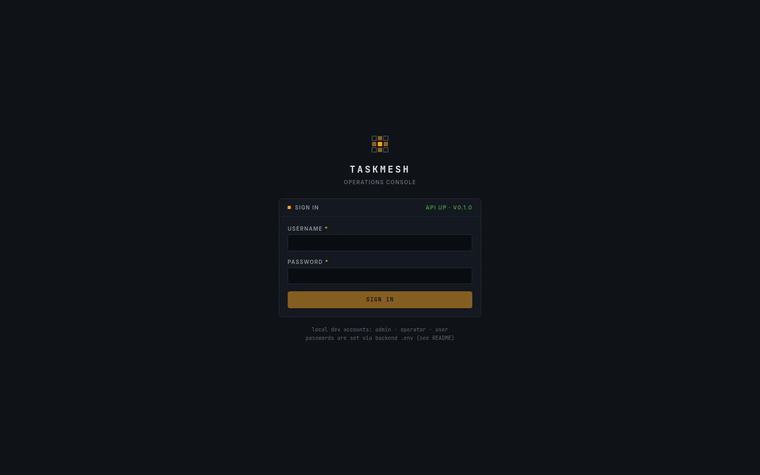

### Screenshots (from the running system)

| Operations — queue lanes, worker fleet, live event ticker | Job detail — timeline, attempts, live log console |
|---|---|
| 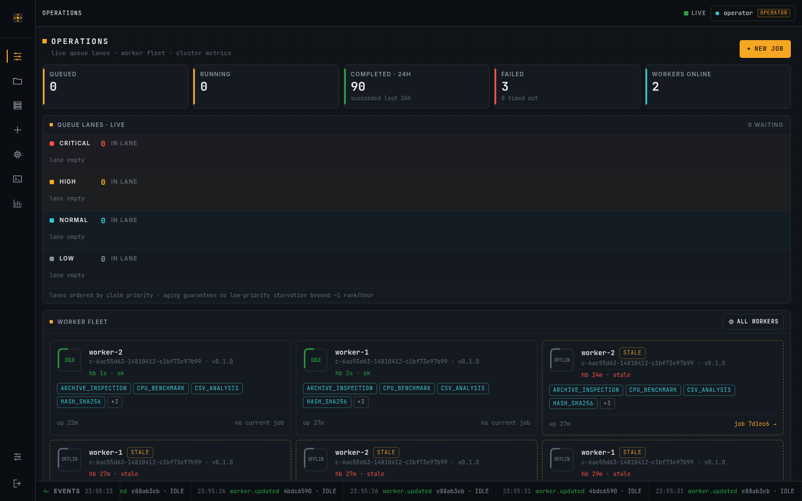 | 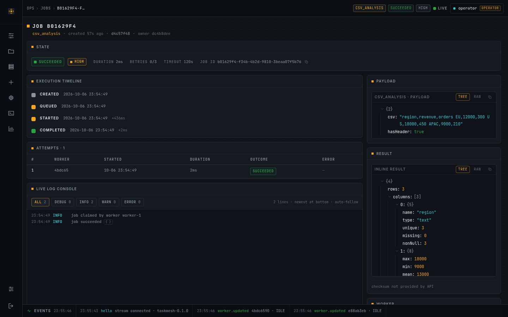 |

| Job running — live progress + streaming logs | Worker fleet — state, heartbeats, staleness |
|---|---|
| 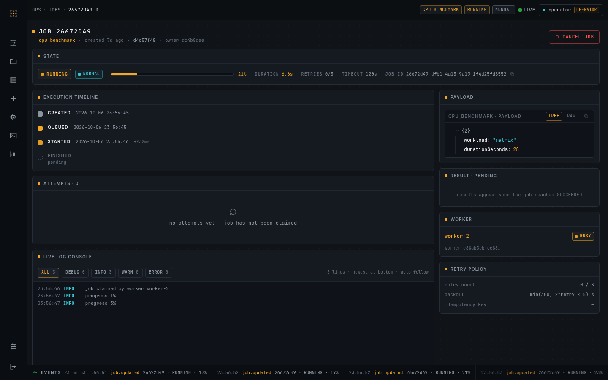 | 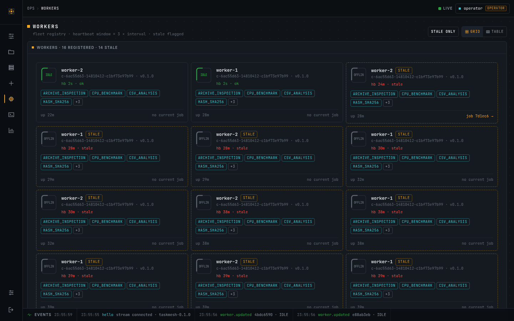 |

| Metrics — status mix, queue depth, throughput | Failed job — error surface, retry path |
|---|---|
| 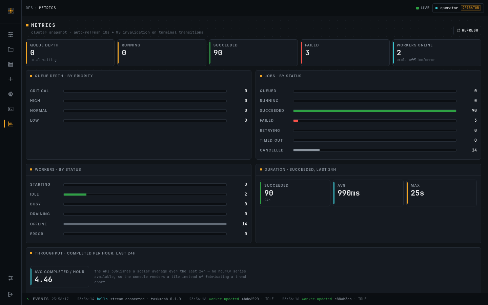 | 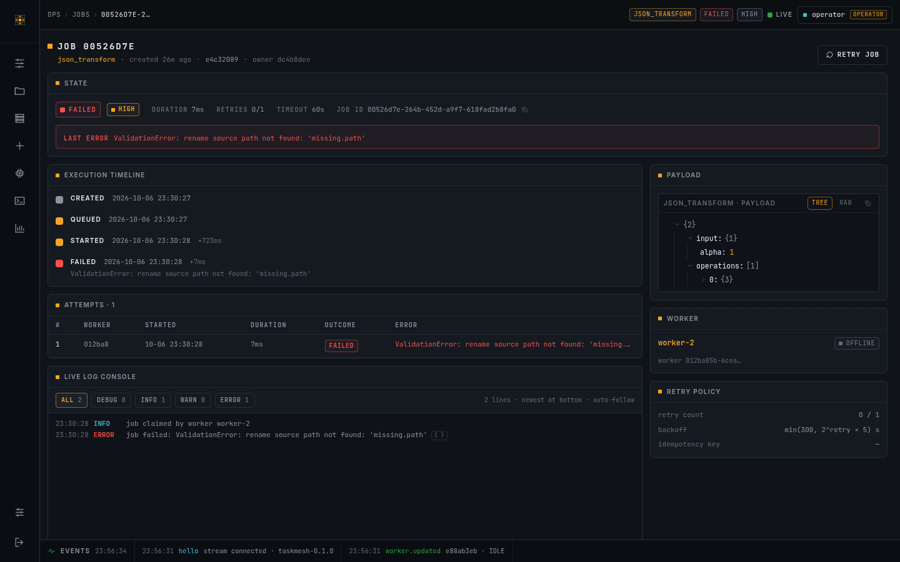 |

More in [`docs/assets/screenshots/`](docs/assets/screenshots/): login, jobs table,
job creation (live type catalog), worker detail, audit logs, settings, project detail.

---

## Table of contents

1. [The problem TaskMesh solves](#the-problem-taskmesh-solves)
2. [Architecture](#architecture)
3. [Job lifecycle](#job-lifecycle)
4. [Worker lifecycle](#worker-lifecycle)
5. [Reliability mechanisms](#reliability-mechanisms) — retry · idempotency · timeout · cancellation · priority
6. [Authentication & authorization](#authentication--authorization)
7. [Database & message broker](#database--message-broker)
8. [REST & WebSocket API](#rest--websocket-api)
9. [Web console](#web-console)
10. [Android app](#android-app)
11. [Local development](#local-development)
12. [Docker deployment](#docker-deployment)
13. [Testing](#testing)
14. [CI/CD](#cicd)
15. [Releases & packages](#releases--packages)
16. [Security](#security)
17. [Troubleshooting](#troubleshooting)
18. [Known limitations](#known-limitations)
19. [Contributing](#contributing)
20. [Copyright & license](#copyright--license)
21. [Documentation](#documentation) — English · مستندات فارسی

---

## The problem TaskMesh solves

Applications constantly need work done *later* or *elsewhere*: crunch an uploaded
CSV, transform JSON payloads, resize images, hash and inspect files, benchmark
hardware. Doing that inline in a request thread couples user latency to compute
time and loses work on failure.

A job platform decouples *submitting* work from *doing* it. The hard parts are
not the handlers — they are the queue semantics:

- **exactly-one-worker-per-attempt claiming** (no double processing),
- **visibility into the queue** (what is queued, running, failed, retrying — and why),
- **failure recovery** (retries with backoff, lease expiry for crashed workers),
- **operator control** (cancel, retry, inspect results and logs, watch workers),
- **honest lifecycle guarantees** (validated state transitions, not best-effort flags).

TaskMesh implements all of it as one deployable system with a typed job catalog,
live consoles, and production plumbing (auth, audit, metrics, CI/CD, containers).

## Architecture

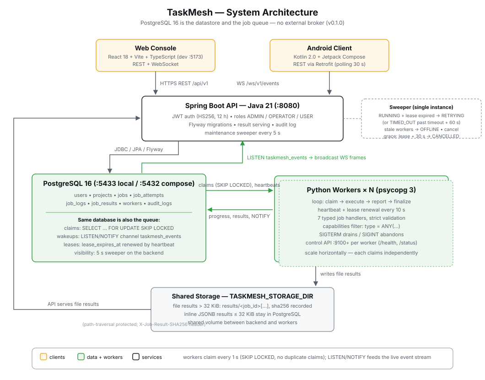

| Component | Tech | Role |
|---|---|---|
| **API** (`backend/`) | Java 21, Spring Boot 3.5 | Validation, state machine, auth (JWT/BCrypt), audit, metrics, WebSocket broadcast, storage serving, 5 s maintenance sweeper |
| **Queue** | PostgreSQL 16 | Jobs, workers, attempts, logs, results, audit — *and* the queue itself (`FOR UPDATE SKIP LOCKED` + `LISTEN/NOTIFY` + leases) |
| **Workers** (`worker/`) | Python 3.12, FastAPI control plane | Register, heartbeat, claim, execute typed handlers in isolated threads, report progress, finalize |
| **Web console** (`web/`) | TypeScript, React 18, Vite, Tailwind 4 | Operations dashboards, job submission from the live type catalog, live logs, worker fleet, metrics |
| **Android client** (`android/`) | Kotlin 2.0, Jetpack Compose | Sign in, browse/submit jobs, live progress via the same API (no web-view) |

Workers are independently scalable: start one or twenty against the same database;
claiming is atomic, so the fleet shares work safely. The API never executes heavy
jobs itself — background work always goes through the queue.

The full data model, state machine and claim SQL are specified in
[docs/SPEC.md](docs/SPEC.md) (the binding contract every component implements) and
explained in [ARCHITECTURE.md](ARCHITECTURE.md).

## Job lifecycle

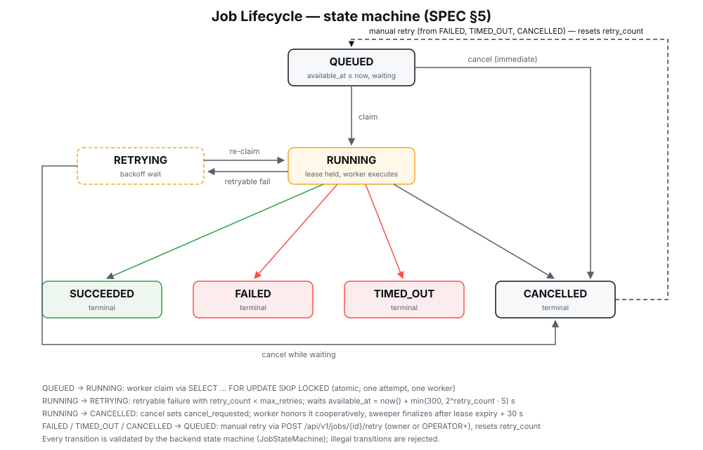

```
QUEUED   → RUNNING      (worker claim, atomic SKIP LOCKED update)
QUEUED   → CANCELLED    (user cancel, immediate)
RUNNING  → SUCCEEDED    (worker success, result persisted)
RUNNING  → FAILED       (non-retryable error, or retries exhausted)
RUNNING  → RETRYING     (retryable failure, retry_count < max_retries)
RUNNING  → TIMED_OUT    (timeout, retries exhausted)
RUNNING  → CANCELLED    (cooperative cancel + sweeper grace)
RETRYING → RUNNING      (re-claim after backoff)
FAILED | TIMED_OUT | CANCELLED → QUEUED   (manual retry via API)
```

Every other transition is rejected by the backend **and** by the worker —
impossible states cannot be written.

## Worker lifecycle

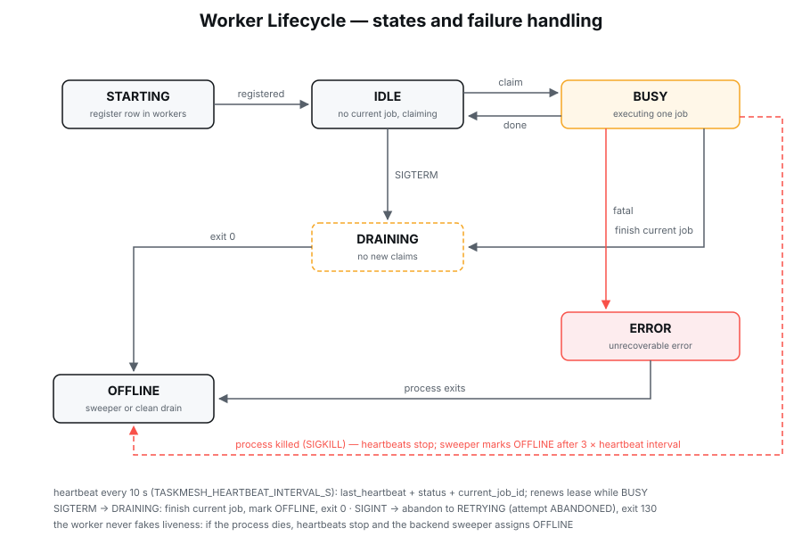

`STARTING → IDLE ⇄ BUSY → DRAINING → OFFLINE`, plus `ERROR` for terminal faults.

- **Registration**: each worker inserts itself into `workers` (id, name, hostname,
  version, capabilities, control port) — its ID lives for the process lifetime.
- **Heartbeat** every 10 s (configurable): updates `last_heartbeat`, status and
  current job, and renews the lease of the job it is running. A dead process
  stops heartbeating — the backend sweeper marks it `OFFLINE` after 3× interval.
  Liveness is never faked.
- **Signals**: `SIGTERM` → `DRAINING` (finish current job, claim nothing, exit 0);
  `SIGINT` → abort current job to `RETRYING` (attempt recorded `ABANDONED`), exit 130.
- **Control API** per worker (FastAPI, port 9100, 9101, …): `GET /health`,
  `GET /status` for local introspection.

## Reliability mechanisms

**Retry strategy.** Retryable failures (transient DB, unexpected handler errors)
move the job to `RETRYING` with exponential backoff
`min(300, 2^retry_count × 5)` s (5 s → 10 s → 20 s … capped 5 min) until
`max_retries` (default 3, max 10) is exhausted, then `FAILED`. Invalid payloads
are non-retryable — bad input fails fast instead of burning retries.

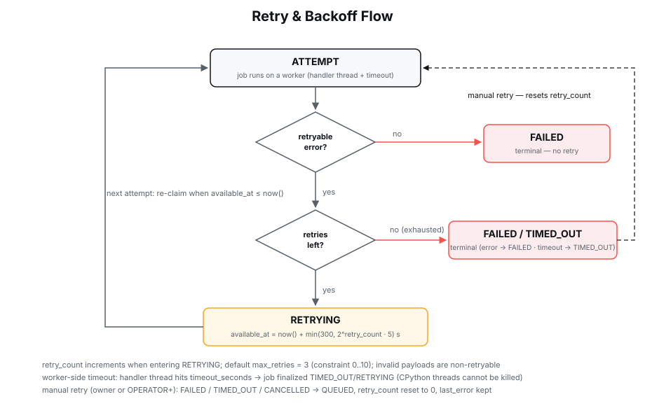

**Idempotency.** Submit with an `idempotencyKey` (or `Idempotency-Key` header):
a unique partial index on `(owner_id, idempotency_key)` makes re-submission
return the original job with `200` instead of creating a duplicate (`201`).

**Timeout handling** (three layers, each with a role):
1. Worker-side hard timeout — the handler thread is interrupted at
   `timeout_seconds` (5–3600, default 120) and the job goes to `RETRYING`.
2. Lease expiry — if a worker dies mid-job, `lease_expires_at`
   (renewed with each heartbeat) passes; the sweeper re-queues the job with
   outcome `ABANDONED`.
3. Hard deadline — `started_at + timeout + 60 s` forces `TIMED_OUT/RETRYING`
   even if leases were somehow kept alive.

**Cancellation.** `POST /jobs/{id}/cancel`: `QUEUED` jobs cancel immediately.
`RUNNING` jobs set `cancel_requested`; the worker checks it before claiming,
between phases and at completion (cooperative), and the sweeper finalizes
`CANCELLED` after lease expiry + 30 s grace if the worker is gone. A stuck
handler cannot be shot mid-instruction — that is a documented limit, not a promise.

**Priority & starvation.** Claim order is
`score = priority_rank + min(age_hours, 1)` — CRITICAL=4 … LOW=1, aging a full
rank per hour. Low-priority jobs cannot starve forever; secondary sort is FIFO.

## Authentication & authorization

- **BCrypt** (cost 10) password hashing; **JWT HS256** (jjwt), 12 h expiry.
- Login rate limit: 10 attempts / minute / username (HTTP 429 beyond).
- Roles (enforced server-side; the UI only *hides* what the API already denies):

| Capability | USER | OPERATOR | ADMIN |
|---|:--:|:--:|:--:|
| own projects / jobs / results | ✅ | ✅ | ✅ |
| submit jobs, cancel/retry own jobs | ✅ | ✅ | ✅ |
| all projects / jobs, cancel/retry any | — | ✅ | ✅ |
| workers, metrics, audit logs | — | ✅ | ✅ |
| user management | — | — | ✅ |

Details: [SECURITY.md](SECURITY.md).

## Database & message broker

**PostgreSQL is both the datastore and the queue** — a deliberate, documented
trade-off ([ARCHITECTURE.md](ARCHITECTURE.md) argues it fully):

- claiming: `SELECT … FOR UPDATE SKIP LOCKED` + atomic `UPDATE → RUNNING`
  (two workers can never hold the same attempt),
- wakeups: `LISTEN/NOTIFY` on channel `taskmesh_events` (no polling lag),
- backoff/priority: `available_at` + aging score in one claim statement,
- leases: `lease_expires_at` renewed by heartbeats, policed by the sweeper,
- auditability: queue state is plain SQL — every job, attempt, log and result
  row can be inspected, joined and alerted on with ordinary queries.

No separate broker to operate, transactional claiming, one durable store. The
queue layer sits behind a repository boundary, so RabbitMQ can be introduced
without touching the domain model — the honest trade-off (single PG instance is
the throughput ceiling; see [limitations](#known-limitations)).

Schema (8 tables: users, projects, workers, jobs, job_attempts, job_logs,
job_results, audit_logs) lives in Flyway migrations
(`backend/src/main/resources/db/migration/`) — canonical DDL in
[docs/SPEC.md §4](docs/SPEC.md).

## REST & WebSocket API

All JSON under `/api/v1`; auth via `Authorization: Bearer <JWT>`; errors always
`{"error":{"code","message"}}`; pagination `{items, page, size, total}`.

Highlights (full table in [docs/SPEC.md §8](docs/SPEC.md)):

| Area | Endpoints |
|---|---|
| Auth | `POST /auth/login`, `GET /me`, `GET/POST /users` (ADMIN) |
| Projects | `GET/POST /projects`, `GET/PATCH/DELETE /projects/{id}` |
| Jobs | `GET/POST /jobs` (filters: project, status, type, priority), `GET /jobs/{id}`, `POST /jobs/{id}/cancel`, `POST /jobs/{id}/retry`, `GET /jobs/{id}/result`, `/logs`, `/attempts` |
| Ops | `GET /workers`, `GET /workers/{id}`, `GET /logs`, `GET /metrics`, `GET /job-types` |

`GET /jobs/{id}/result` returns inline JSON, or file bytes with an
`X-Job-Result-SHA256` integrity header.

**WebSocket** `GET /ws/v1/events?token=<JWT>` — server push, text frames:
`job.updated` (status + progress), `job.log` (live log lines), `worker.updated`,
`queue.event`. The console merges these with REST history — the live log console
on the job page is exactly this stream.

## Web console

React 18 + Vite + Tailwind CSS 4 SPA (`web/`), dark "control-room" design built
around queue visibility: queue lanes with live depth, KPI strip, worker fleet
tiles, an event ticker fed straight from the WebSocket, dense filterable job
table, and a job-create form generated from the **live** `/job-types` catalog
(payload forms, examples and validation come from the API, not hard-coded).

Routes: Operations `/` · Projects `/projects` · Jobs `/jobs` · Job detail
`/jobs/:id` (timeline, attempts, live log console, result) · Workers `/workers`
(OPERATOR+) · Audit logs `/logs` · Metrics `/metrics` · Settings `/settings`.
Role-adaptive: USER sees own data only; reconnect-with-backoff socket with
connection LED and stale-frame detection. [web/README.md](web/README.md).

## Android app

Native Kotlin 2.0 / Jetpack Compose client (`android/`) — Retrofit against the
same API, kotlinx-serialization DTOs, token store, job list/detail with live
progress, submission from the type catalog, and a notifications screen.
minSdk 26 / target 35; debug builds allow cleartext for emulator development
(`http://10.0.2.2:8080`), release builds require HTTPS.
[android/README.md](android/README.md).

## Local development

Prerequisites: JDK 21, Maven 3.9, Python 3.12, Node 20+, PostgreSQL 16
(local convention: port **5433**, db `taskmesh`, user `taskmesh`).

```bash
# 1. database (any PostgreSQL 16; Flyway migrates + seeds on backend start)
createdb -h localhost -p 5433 -U taskmesh taskmesh

# 2. backend (http://localhost:8080)
cd backend && mvn -DskipTests package && java -jar target/taskmesh-backend.jar

# 3. workers (one per terminal; control ports 9100, 9101, …)
cd worker && pip install -e . && taskmesh-worker

# 4. web console (http://localhost:5173, proxies /api and /ws to :8080)
cd web && npm install && npm run dev
```

Seeded dev accounts (BCrypt-hashed in Flyway V2 — change them for anything
shared):

| username | password | role |
|---|---|---|
| `admin` | `TaskMesh!Admin` | ADMIN |
| `operator` | `TaskMesh!Operator` | OPERATOR |
| `user` | `TaskMesh!User` | USER |

Configuration is env-only (`TASKMESH_DB_URL`, `TASKMESH_JWT_SECRET`,
`TASKMESH_STORAGE_DIR`, `TASKMESH_CORS_ORIGINS`, worker
`TASKMESH_DATABASE_URL` / `TASKMESH_CONTROL_PORT` / …) — see
[.env.example](.env.example) and [docs/SPEC.md §12](docs/SPEC.md).
Backend and workers must share one `TASKMESH_STORAGE_DIR` for file results.

An end-to-end smoke suite lives at `scripts/e2e_smoke.py`
(login → project → submit each of the 7 job types → track → verify results →
cancel/retry paths; 44 checks).

## Docker deployment

`deploy/compose/docker-compose.yml` — one command:

```bash
cd deploy/compose
cp ../../.env.example .env    # fill TASKMESH_DB_PASSWORD, TASKMESH_JWT_SECRET
docker compose up -d          # postgres + backend + worker (scalable) + web
```

Web on http://localhost:8081 (nginx: SPA + `/api` + `/ws` reverse proxy),
API on 8080, images from `ghcr.io/parsafathii/taskmesh-{backend,worker,web}`.
Multi-stage Dockerfiles, non-root uid 10001, healthchecks, OCI labels.
Workers scale horizontally: `docker compose up -d --scale taskmesh-worker=3`.

## Testing

| Suite | Count | Command |
|---|---|---|
| Backend unit + integration | 99 | `cd backend && mvn clean verify` (needs PG on :5433) |
| Worker unit + integration | 146 | `cd worker && python -m pytest -q` |
| Web console (vitest + RTL) | 62 | `cd web && npm run test -- --run` |
| Android JVM | 75 | `cd android && ./gradlew testDebugUnitTest` |
| E2E smoke (black-box) | 44 checks | `cd scripts && python e2e_smoke.py` (needs full stack) |

## CI/CD

GitHub Actions (`.github/workflows/`):

- **ci.yml** — backend (PG service container), worker, web (Node 20/22 matrix),
  android on every push/PR; all gates must pass.
- **security.yml** — CodeQL (Java/Python/JS), gitleaks secret scanning.
- **dependency-review.yml** — Dependabot version diff checks on PRs.
- **docker.yml** — builds and pushes `backend`/`worker`/`web` images to
  ghcr.io with semver + dev tags (on main and tags).
- **release.yml** — on tag `v*.*.*`: version-consistency check, full validation,
  artifacts (jar, wheel, sdist, web zip, unsigned APK), CycloneDX SBOMs per
  component, `SHA256SUMS`, and a GitHub Release with verified assets.

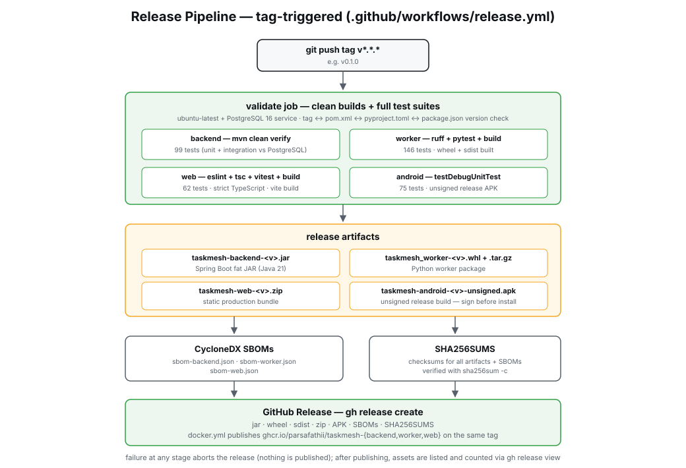

## Releases & packages

Latest: [v0.1.0](https://github.com/ParsaFathii/TaskMesh/releases/tag/v0.1.0)
(2026-10-07) — 9 assets:

- `taskmesh-backend-0.1.0.jar` (fat jar)
- `taskmesh_worker-0.1.0-py3-none-any.whl` + sdist
- `taskmesh-web-0.1.0.zip` (static build behind nginx config)
- `taskmesh-android-0.1.0-unsigned.apk` (sign with your keystore to install)
- CycloneDX SBOMs (backend/worker/web) + `SHA256SUMS` (verified in-workflow)

Container packages on ghcr.io: `parsafathii/taskmesh-backend`, `-worker`, `-web`.
Verify any artifact: `sha256sum -c SHA256SUMS`.

## Security

JWT secrets env-only (startup WARN on the dev default), BCrypt cost 10, login
rate limiting, strict two-layer payload validation (API + worker), result files
served with path-traversal protection, UUID-derived storage paths, sha256
checksums on results, no arbitrary-code job types, pinned action SHAs where
practical, CodeQL + gitleaks + dependency review + SBOMs in CI, non-root
containers. Full write-up incl. threat model and port exposure table:
[SECURITY.md](SECURITY.md).

## Troubleshooting

| Symptom | Cause / fix |
|---|---|
| Console shows 403 after login | Origin not in `TASKMESH_CORS_ORIGINS` (dev default only allows `http://localhost:5173` — use `localhost`, not `127.0.0.1`, or extend the list) |
| Workers never claim | Check `TASKMESH_DATABASE_URL` (worker) vs `TASKMESH_DB_URL` (backend) point at the same database; worker logs WARN on DB outage and retries |
| File result 404 | Backend and worker `TASKMESH_STORAGE_DIR` differ — must be the same host path or shared volume |
| Job stuck RUNNING | Lease expiry + hard deadline need ≤ 5 s sweeper + 60 s margin; if it persists, check the worker's heartbeat in `/workers` (stale flag) |
| Login 429 | Rate limit is 10/min/username — wait a minute |
| CI integration tests fail | They need the dedicated `taskmesh_test` DB on :5433 (created + migrated automatically; never point dev at it) |
| Release APK won't install | It is unsigned by design: `apksigner sign --ks your.keystore …` |

## Known limitations

Honest scope of 0.1.0 (tracked in [docs](docs/) and CHANGELOG):

- Single PostgreSQL instance is the throughput ceiling; RabbitMQ integration is
  the prepared-but-not-wired alternative (repository boundary kept clean).
- Cancellation of RUNNING jobs is cooperative — a wedged handler is finalized
  only by the sweeper after lease expiry + grace, not killed mid-instruction.
- The sweeper is a single scheduled task per backend instance (run one backend
  or make the task leader-elected).
- No multi-tenancy model (roles are global), no result streaming for very large
  inline payloads (> 32 KiB becomes a file), Android release APK unsigned.
- Job results are retained until the owning project is deleted; no TTL sweeper
  yet.

## Contributing

PRs welcome — see [CONTRIBUTING.md](CONTRIBUTING.md): per-component dev setup,
pre-PR gates (the four test suites + lint), Conventional Commits, review
expectations, and the android `.gitignore` guard warning.

## Copyright & license

Copyright © 2026 Parsa Fathi. Licensed under the
[Apache License 2.0](LICENSE) — see [NOTICE](NOTICE) and
[THIRD_PARTY_NOTICES.md](THIRD_PARTY_NOTICES.md) for third-party attribution
(their code keeps their licenses; this project claims only its own originals).

## Documentation

**English** — [docs index](docs/README.md) ·
[SPEC](docs/SPEC.md) · [ARCHITECTURE](ARCHITECTURE.md) ·
[SECURITY](SECURITY.md) · [CONTRIBUTING](CONTRIBUTING.md) ·
[CHANGELOG](CHANGELOG.md) · component READMEs:
[backend](backend/README.md) · [worker](worker/README.md) ·
[web](web/README.md) · [android](android/README.md)

**مستندات فارسی (Persian)** — [README_FA](docs/fa/README_FA.md) ·
[نصب](docs/fa/INSTALLATION_FA.md) ·
[راهنمای کاربری](docs/fa/USER_GUIDE_FA.md) ·
[معماری](docs/fa/ARCHITECTURE_FA.md) ·
[کارها](docs/fa/JOBS_FA.md) ·
[ورکرها](docs/fa/WORKERS_FA.md) ·
[API](docs/fa/API_FA.md) ·
[امنیت](docs/fa/SECURITY_FA.md) ·
[توسعه](docs/fa/DEVELOPMENT_FA.md) ·
[انتشار](docs/fa/RELEASE_FA.md) ·
[حق نشر](docs/fa/COPYRIGHT_FA.md)
